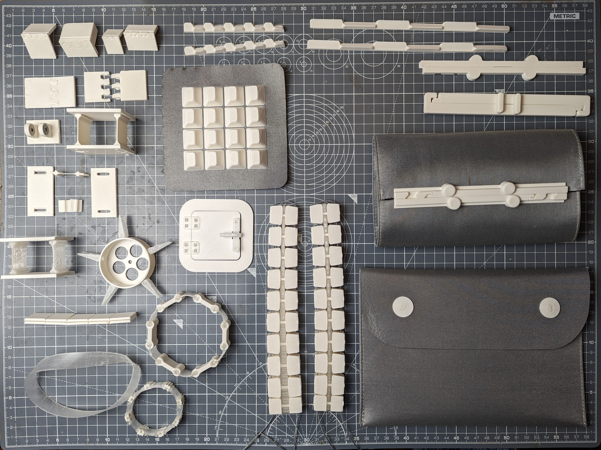
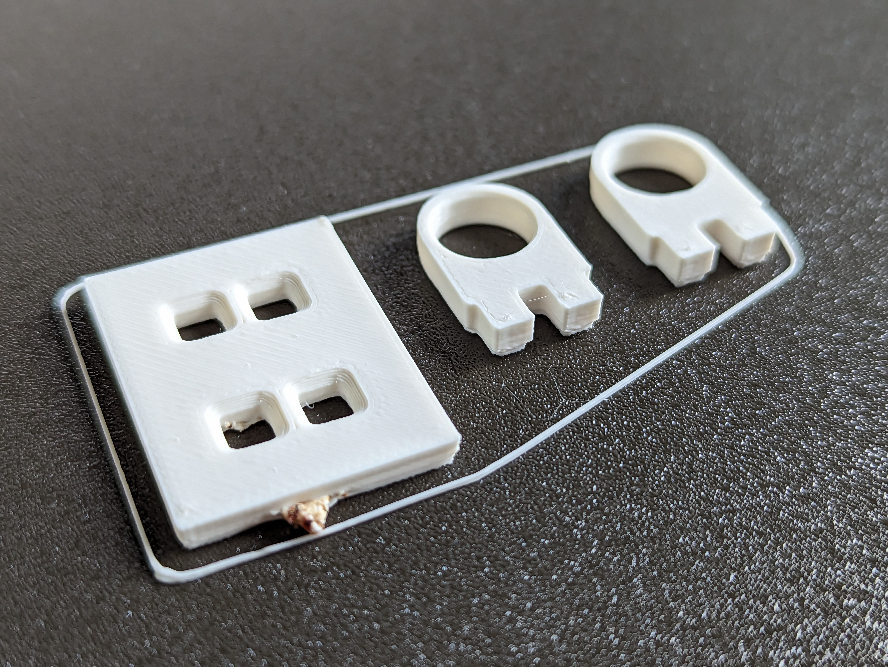
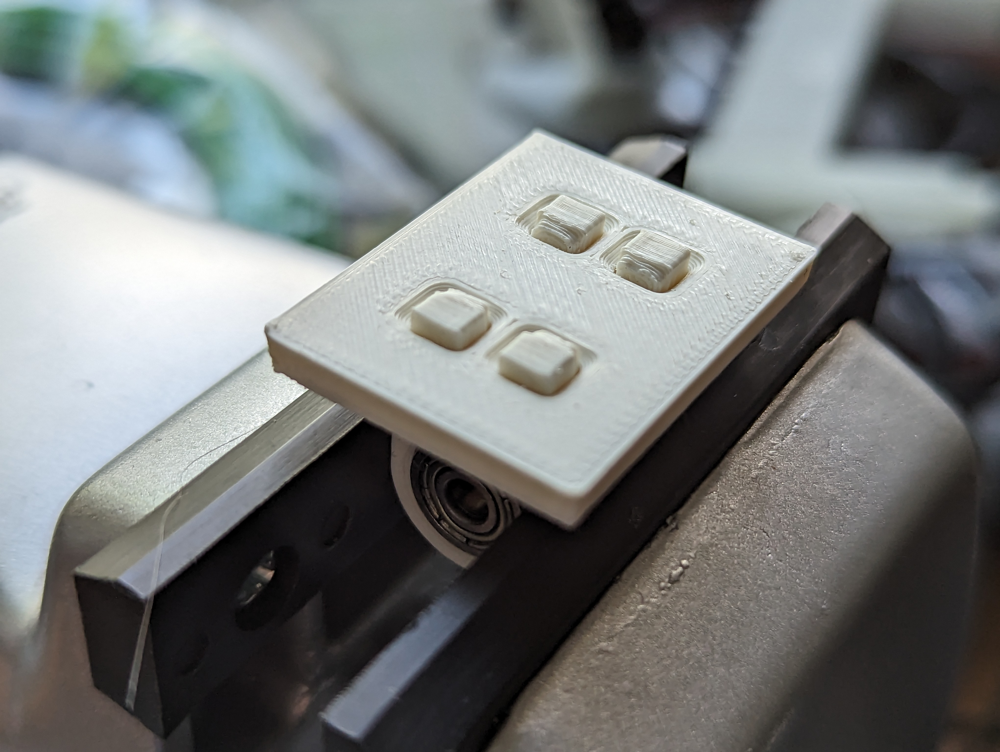
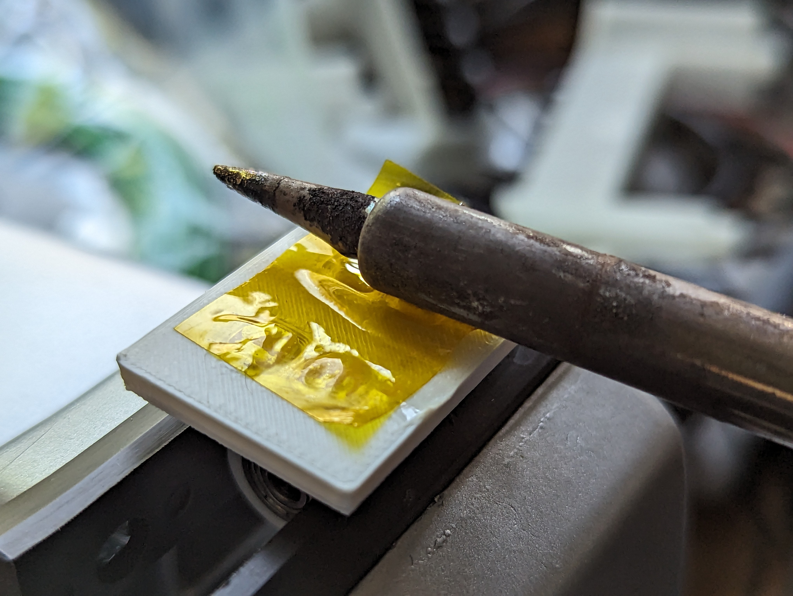
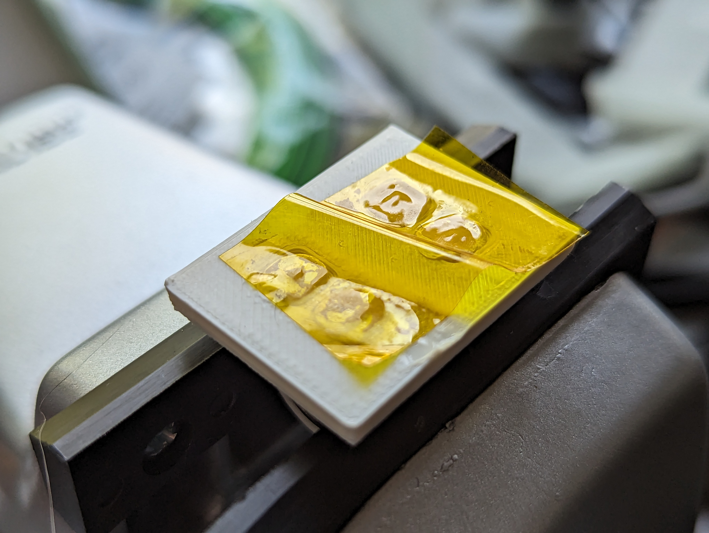
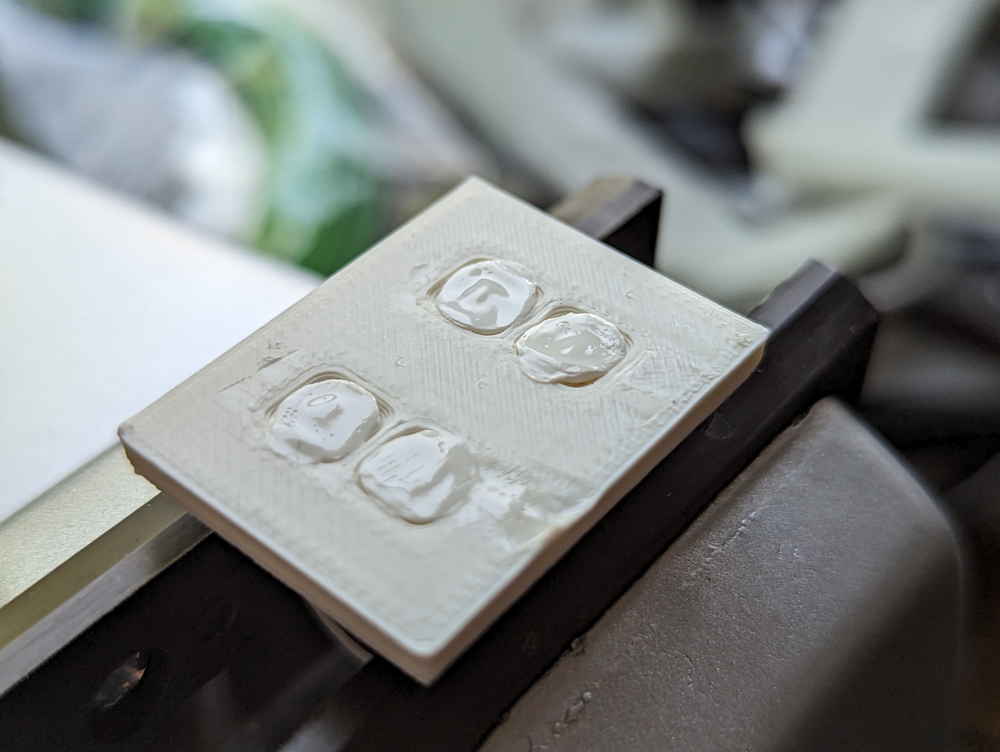
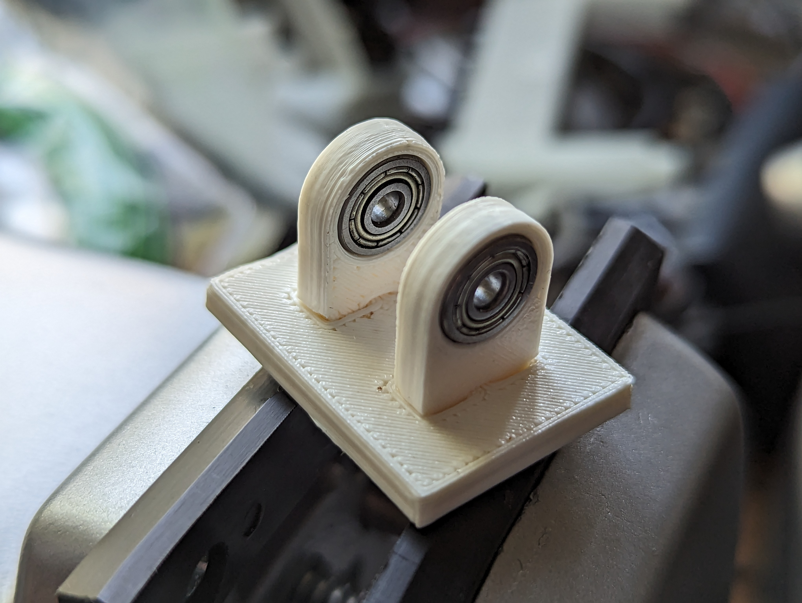
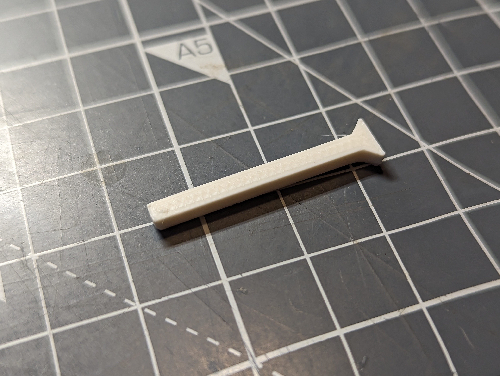

# makevember-23-heat-staking

# Heat-staked joints for assembling 3D prints

Jarkman Industries, 11/23

richard@jarkman.co.uk

.

# Introduction

This is a method of joining 3D printed parts by melting over (‘heat staking’) printed pins or fins on one part that pass through holes in another part. The melted-over material makes the pin fat so it can’t pull back through the hole. A countersink around the hole lets the melted material go flush with the surface.

I started it as a process exploration series for #makevember 2023 (https://chickengrylls.wordpress.com/2017/10/31/the-makevember-manifesto/), in a series on Mastodon (@jarkman@chaos.social if you want to look at it)

The melting is done with the side of a soldering iron, with a bit of Kapton tape to stop the melted material sticking to the iron. Many thanks to Jeff Epler for this trick:

https://emergent.unpythonic.net/01612362040

As an assembly technique for 3D prints, it has a lot to recommend it:

* Quick
* Cheap
* Very compact (much smaller than nuts and bolts, self-tappers, heat-set inserts)
* Different components of the assembly can be printed in different orientations so the layer lines are best oriented for strength
* Often possible to eliminate the need for support material
* Probably prints quicker than a complex single part with support
* Different components can be in different materials
* Can also be used to join printed parts to other materials, eg fabrics

And it has some disadvantages:

* More CAD to do, compared to an all-in-one part
* Can look a bit messy
* Not dismantlable
    * Actually, I have not tried, it might be possible to cut the stake out with a Dremel to remove the inserted part and re-use the part with the hole. But you wouldn't want to.

There's a lot of unexplored territory:

* Haven’t done any strength comparison testing
* Only tried in ASA and TPU and TPU-to-ASA but I expect any printable materials would work
* Haven’t tried really big pins
* Haven’t tried printed parts inserted into (eg) metal parts

Most of my experiments have been with 3mm thick plates. It was very easy to do 5mm pegs in 5mm plates. 2mm pins really didn’t work at all, because the printing inaccuracies made everything fit too badly.

I think there is a lot of new space to explore with these techniques. If you do any experiments of your own, please let me know, I'm eager to see what is possible.

.
.
.
.
.
.

All the images and videos for the series are here: https://photos.app.goo.gl/8kNiENX5PBy6sVhRA

# Design rules

These are the rules I’ve converged on over these experiments. I’m sure there are many other ways to do this but this worked for me and is probably a sensible place to start. All my tests were in ASA and TPU, but I expect the techniques will work identically in other materials.

I used these shapes:

Pegs, either round or square, 3 or 4mm. Square is easiest to print horizontally, with no support if the design allows or with easier cleanup if you do use support.

Vertical 3mm pins are ridiculously weak. If the rest of design means the pin has to be vertical, it may be worth using a separate pin piece that is printed horizontally. See Tentacle 2 and 3 for examples. You can snip overlong pins to length with side cutters.

.

Fins, 2mm wide, 10mm long and longer

Triangles, with one horizontal face and two 45 degree faces, 3mm high and up

Dovetails with 30 degree edges

I generally had a 1mm chamfer or countersink round the edge of the hole to receive the melted material.

The pin/fin had a 1 or 1.5mm stickout through the hole, so as to have enough material to melt and fill the countersink.

On the 5mm pin, I used a counterbore in the end of the pin so you are just melting a 1mm high, 1mm wide annular ridge rather than the whole end of the pin.

I typically enlarge holes by 0.1mm all round (0.2mm in width) over the size of the pin to make assembly easy. This clearance probably depends on how accurate your printer is.

Sometimes I have to use a needle file to clean up printer nubbins inside slots.

There’s usually a small radius at the base of the peg/pin as a result of the printing process, so adding a a 0.5mm countersink on the part side of the hole makes it easier for the assembly to go together tightly

For most shapes, you need a shoulder on the part side to stop the part falling through the hole. You can’t just have a pin. Say 1 or 2 mm, probably needs to be on at least 2 sides for stability unless you have a very long/fat pin

# Process

Assemble the parts tightly (nice to hold the part in a vice but whatever works)

Put a bit of Kapton tape over the end of the pin

Use the side of a soldering iron (I set mine to 300C) to press on the end of the pin/fin

As it melts, roll the soldering iron a bit to squish it down nicely into the countersink, should not need much force.

Once it is set, peel off the Kapton, which can be reused.

# Geometries I’ve tried

Plates joined at 90 degrees

Plates joined flat

Small parts joined to plates with pegs

Fat edges slid into slots

# Makevember list

stl files (and some 3mf files to clarifly printing layout) for all the Makevember tests are in this repository. 

Images and videos are here: https://photos.app.goo.gl/8kNiENX5PBy6sVhRA

### Tests

5mm round tenons, for a 90 degree joint between parts

2mm round tenons, for a 90 degree joint between parts. Not very successful, hard to get a good fit and not very strong.

3mm triangle tenons for a 90 degree joint. Worked OK, needed a lot of hand cleanup to get the parts to fit.

3mm butt join with end Vs - failed

3mm butt join with side Vs - worked! But the pes tended to warp upwards in printing so the joitn was not flat overall.

3mm dovetail tenons for a 90 degree joint - worked, probably my favourite for (eg) a box edge.

3mm square tenons for bearing mount - worked great.

ASA flexure - Not flexible.

ASA thin failed flexure - just broke

Flexure with ASA plates and TPU flexibles - worked well

Chained hard-soft-hard - worked well. No idea what it is for. 

TPU belt with hard feet - worked well.

Wheel with soft nubbins - worked well

Door with soft hinge and latch - good hinges, bad latch.

Magnetic flip-top bag - worked well

Pencil case - worked OK

Pyramid grid - worked well, feels like there are many interesting possibilities here, reminds me of the 3d-printing-onto-mesh techniques

Pencil case 2 - better than pencil case 1.

Pretensioned tile strip - worked

Mobius Strip in TPU - really good join

Tentacle 1 - failed because of weak cross-grain pins

Tentacle 2 - with separate pins - good

Tentacle 3 - as Tentacle 2 but with a tapered spine to give a different flex shape - also good

### Ideas not yet made

Side-curved tentacle

Tentacle which curves sideways as it deflects

Circular spring to close a tube/bag

Soft sheet with hard scales

Pencil roll with TPU nubbins for closure

comb joints

Ben's sloped-base tenons   

Fabric with hooks

TPU and card

Adding printed parts to Correx sheet

Hinged track with soft feet
